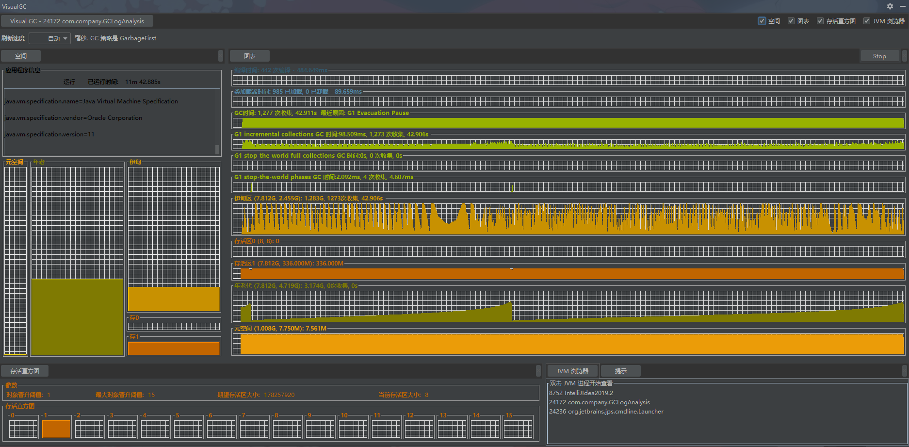

# 作业
***
## 作业一
### 作业要求：
&ensp;&ensp;&ensp;&ensp;自己写一个简单的Hello.java，里面需要涉及基本类型，四则运行，if和for，然后自己分析一下对应的字节码，有问题群里讨论。

&ensp;&ensp;&ensp;&ensp;学习中搜索到的相应参考链接：

- [字节码指令集oracle文档:https://docs.oracle.com/javase/specs/jvms/se7/html/jvms-6.html#jvms-6.5](https://docs.oracle.com/javase/specs/jvms/se7/html/jvms-6.html#jvms-6.5)

### 思路
- 1.首先在当前周下week_01下建立代码工程目录：code，并新建工程
- 2.编写代码文件：MyHello.java(src目录下)
- 3.编译生成：MyHello.class(build目录下)
- 4.字节码解释

#### MyHello.java

```java
import java.util.ArrayList;
import java.util.List;

public class MyHello {
    public static void main(String[] args) {
        int num1 = 1;
        int num2 = 130;
        int num3 = num1 + num2;
        int num4 = num2 - num1;
        int num5 = num1 * num2;
        int num6 = num2 / num1;

        final int num7 = 5;
        Integer num88 = 6;

        // 仅作为试验，看装箱指令
        if (num88 == 0) {
            System.out.println(num1);
        }

        List<Integer> nums = new ArrayList<>();
        nums.add(1);
        nums.add(2);

        for (int num : nums) {
            System.out.println(num);
        }

        if (nums.size() == num2) {
            System.out.println(num2);
        }
    }
}
```

### 字节码展示及相关说明

```shell script
PS C:\Users\12439\Documents\Code\Java\JAVA-000\Week_01\code\build\classes\java\main> javap -c .\MyHello.class
Compiled from "MyHello.java"
public class MyHello {
  public MyHello();
    // 调用父类Object的初始化函数
    Code:
       0: aload_0
       1: invokespecial #1                  // Method java/lang/Object."<init>":()V
       4: return

  public static void main(java.lang.String[]);
    Code:
       // 初始化变量num1
       0: iconst_1
       1: istore_1

       // 初始化化变量num2，这里的指令有些变化，这里查资料得到不同数据类型和访问值会用到不同的指令，可以看下面的int数据类型指令表
       2: sipush        130
       5: istore_2

       // 计算num3
       6: iload_1
       7: iload_2
       8: iadd
       9: istore_3
       
      // 计算num4
      10: iload_2
      11: iload_1
      12: isub
      13: istore        4

      // 计算num5
      15: iload_1
      16: iload_2
      17: imul
      18: istore        5

      // 计算num6
      20: iload_2
      21: iload_1
      22: idiv
      23: istore        6

      // 初始化化变量num7
      25: iconst_5
      26: istore        7

      // 初始化化变量num88,这里可以看到触发了Integer的自动装箱；想到写程序时还是尽量用基础类型，这样快点，不然会触发自动装箱/拆箱，多一些指令
      28: bipush        6
      30: invokestatic  #2                  // Method java/lang/Integer.valueOf:(I)Ljava/lang/Integer;
      33: astore        8

      // 判断，调用静态方法打印
      35: aload         8
      37: invokevirtual #3                  // Method java/lang/Integer.intValue:()I
      40: ifne          50
      43: getstatic     #4                  // Field java/lang/System.out:Ljava/io/PrintStream;
      46: iload_1
      47: invokevirtual #5                  // Method java/io/PrintStream.println:(I)V

      // 这里初始化list容器对象
      50: new           #6                  // class java/util/ArrayList
      53: dup
      54: invokespecial #7                  // Method java/util/ArrayList."<init>":()V
      57: astore        9

      // 这里获取list，生成Integer，进行添加
      59: aload         9
      61: iconst_1
      62: invokestatic  #2                  // Method java/lang/Integer.valueOf:(I)Ljava/lang/Integer;
      65: invokeinterface #8,  2            // InterfaceMethod java/util/List.add:(Ljava/lang/Object;)Z
      70: pop

      71: aload         9
      73: iconst_2
      74: invokestatic  #2                  // Method java/lang/Integer.valueOf:(I)Ljava/lang/Integer;
      77: invokeinterface #8,  2            // InterfaceMethod java/util/List.add:(Ljava/lang/Object;)Z
      82: pop

      // 获取迭代器
      83: aload         9
      85: invokeinterface #9,  1            // InterfaceMethod java/util/List.iterator:()Ljava/util/Iterator;
      90: astore        10
      // 遍历容器打印
      92: aload         10
      94: invokeinterface #10,  1           // InterfaceMethod java/util/Iterator.hasNext:()Z
      99: ifeq          128
     102: aload         10
     104: invokeinterface #11,  1           // InterfaceMethod java/util/Iterator.next:()Ljava/lang/Object;
     109: checkcast     #12                 // class java/lang/Integer
     112: invokevirtual #3                  // Method java/lang/Integer.intValue:()I
     115: istore        11
     117: getstatic     #4                  // Field java/lang/System.out:Ljava/io/PrintStream;
     120: iload         11
     122: invokevirtual #5                  // Method java/io/PrintStream.println:(I)V
     125: goto          92

     // 容器大小判断
     128: aload         9
     130: invokeinterface #13,  1           // InterfaceMethod java/util/List.size:()I
     135: iload_2
     136: if_icmpne     146
     139: getstatic     #4                  // Field java/lang/System.out:Ljava/io/PrintStream;
     142: iload_2
     143: invokevirtual #5                  // Method java/io/PrintStream.println:(I)V

     146: return
}
```

### int数据类型指令表
&ensp;&ensp;&ensp;&ensp;int(bool,byte,char,short)常用指令及范围如下：

- iconst: [-1, 5]
- bipush: [-128, 127]
- sipush: [-32768, 32767]
- idc: any int value

&ensp;&ensp;&ensp;&ensp;其他的就不展示了，搜索相关资料也能查到。字节码这部分内容感觉有个大概了解就行了，不必太深入。

## 作业二
### 作业要求：
&ensp;&ensp;&ensp;&ensp;自定义一个Classloader，加载一个Hello.xlass文件，执行hello方法，此文件内容是一个Hello.class文件所有字节(x=255-x)处理后的文件。文件群里提供。

### 思路
- 1.首先了解类加载的相关机制，为啥需要类加载器
- 2.自定义类加载器编写要点：
    - 1.继承类：ClassLoader，并重写方法：findClass
    - 2.核心加载函数：defineClass，其需要字节码文件的字节流及类名；则思路为读取字节码文件成字节流，传入字节流及函数名称即可
    - 3.字节流读取的特殊处理：应被相应加密处理过了，读取的时候进行相应的解密
    - 4.加载class文件，实例化，调用函数
    
 &ensp;&ensp;&ensp;&ensp;这里使用文件绝对路径
 
 ### 完整代码
 
 ```java
import java.io.*;
import java.lang.reflect.InvocationTargetException;

/**
 * 自定义类加载
 * 关键点是defineClass,读取字节码的字节流，生成class，思路就是转化class文件为字节流，传入defineClass中
 * 思路：
 * 1.继承ClassLoader，重写findClass方法
 * 2.从文件中读取转化成字节流
 * 3.传入defineClass进行加载
 * 4.生成实例，调用方法
 */
public class HelloClassLoader extends ClassLoader {
    @Override
    public Class findClass(String name) {
        byte[] b = new byte[0];
        try {
            b = loadClassFromFile(name);
        } catch (FileNotFoundException e) {
            e.printStackTrace();
        }
        // name 就是加载的类名称，这里注意要填写正确
        return defineClass("Hello", b, 0, b.length);
    }

    /**
     * 读取class文件，转化内容为字节流
     * @param fileName 文件路径
     * @return
     * @throws FileNotFoundException
     */
    private byte[] loadClassFromFile(String fileName) throws FileNotFoundException {
        System.out.println(fileName);
        File file = new File(fileName);
        FileInputStream inputStream = new FileInputStream(file);
        byte[] buffer;
        ByteArrayOutputStream byteStream = new ByteArrayOutputStream();
        int nextValue = 0;
        try {
            while ( (nextValue = inputStream.read()) != -1 ) {
                // 注意字节还原
                byteStream.write(255 - nextValue);
            }
        } catch (IOException e) {
            e.printStackTrace();
        }
        buffer = byteStream.toByteArray();
        return buffer;
    }

    public static void main(String[] args) throws ClassNotFoundException, NoSuchMethodException, IllegalAccessException, InstantiationException, InvocationTargetException {
        // 文件读取，字节流转换，加载
        String path = "C:\\Users\\12439\\Documents\\Code\\Java\\JAVA-000\\Week_01\\code\\src\\main\\resources\\Hello.xlass".replace("\\", "/");
        HelloClassLoader loader = new HelloClassLoader();
        Class hello = loader.loadClass(path);
        System.out.println(hello.getName());
        // 生成实例，调用方法
        Object instance = hello.newInstance();
        System.out.println(hello.getMethod("hello").invoke(instance));
    }
}
```

## 作业三
### 作业要求
&ensp;&ensp;&ensp;&ensp;画一张图，展示Xmx 、 Xms 、 Xmn 、 Meta 、 DirectMemory 、 Xss 这些内存参数的关系。

### 思路
&ensp;&ensp;&ensp;&ensp;首先要了解上面各个参数的含义：

- Xmx：指定最大堆内存
- Xms：指定堆内存空间的初始大小
- Xmn：设置新生代初始和最大大小；设置过小会导致频繁GC，过大会导致GC一次时间过长；建议1/2~1/4
- Meta(-XX:MaxMetaspaceSize=size)：设置Meta空间大小
- DirectMemory(-XX:MaxDirectMemorySize=size)：设置系统可使用的最大堆外内存
- Xss：设置每个线程栈的字节数

### 内存模型及相应参数对应图


## 作业四、五（一起做了）
### 作业要求 
&ensp;&ensp;&ensp;&ensp;作业4：检查一下自己维护的业务系统的JVM参数配置，用jstat和jstack、jmap查看一下详情，并且自己独立分析一下大概情况，思考有没有不合理的地方，如何改进。

&ensp;&ensp;&ensp;&ensp;作业5：本机使用G1 GC启动一个程序，仿照课上案例分析一下JVM情况

&ensp;&ensp;&ensp;&ensp;这里使用秦老师的GC日志分析的代码进行运行，然后使用命令查看下情况（Java11，G1 GC），完整的代码如下：不断生成新的对象

```java
package com.company;

import java.util.Random;
import java.util.concurrent.TimeUnit;
import java.util.concurrent.atomic.LongAdder;

/**
 * GC日志生成演示与解读
 */
public class GCLogAnalysis {

    private static Random random = new Random();

    public static void main(String[] args) {
        // 当前毫秒时间戳
        long startMillis = System.currentTimeMillis();
        // 持续运行毫秒数，可根据需要进行修改
        long timeoutMillis = TimeUnit.SECONDS.toMillis(1);
        // 结束时间戳
        long endMillis = startMillis + timeoutMillis;
        LongAdder counter = new LongAdder();
        System.out.println("正在执行");

        // 缓存一部分对象，进入老年代
        int cacheSize = 2000;
        Object[] cacheGarbege = new Object[cacheSize];

        // 在此时间范围内，持续循环
        while (true) {
//        while (System.currentTimeMillis() < endMillis) {
            // 生成垃圾对象
            Object garbage = generateGarbage(100 * 1024);
            counter.increment();
            int randomIndex = random.nextInt(2 * cacheSize);
            if (randomIndex < cacheSize) {
                cacheGarbege[randomIndex] = garbage;
            }
            System.out.println("执行中！ 共生成对象次数：" + counter.longValue());
        }

//        System.out.println("执行结束！ 共生成对象次数：" + counter.longValue());
    }

    /**
     * 生成对象
     * @param maxSize
     * @return
     */
    private static Object generateGarbage(int maxSize) {
        int randomSize = random.nextInt(maxSize);
        int type = randomSize % 4;
        Object result = null;
        switch (type) {
            case 0:
                result = new int[randomSize];
                break;
            case 1:
                result = new byte[randomSize];
                break;
            case 2:
                result = new double[randomSize];
                break;
            default:
                StringBuilder builder = new StringBuilder();
                String randomString = "randomString-Anything";
                while (builder.length() < randomSize) {
                    builder.append(randomString);
                    builder.append(maxSize);
                    builder.append(randomSize);
                }
                result = builder.toString();
                break;
        }
        return result;
    }
}
```

&ensp;&ensp;&ensp;&ensp;GC的相关统计信息如下：

```bash
❯ .\jstat.exe -gc 24172 100 100
 S0C    S1C    S0U    S1U      EC       EU        OC         OU       MC     MU    CCSC   CCSU   YGC     YGCT    FGC    FGCT    CGC    CGCT     GCT
 0.0   399360.0  0.0   399360.0 4485120.0 614400.0 2867200.0   943206.2  7936.0 7742.8 768.0  687.5     849   28.181   0      0.000   4      0.005   28.185
 0.0   399360.0  0.0   399360.0 4485120.0 1325056.0 2867200.0   943206.2  7936.0 7742.8 768.0  687.5     849   28.181   0      0.000   4      0.005   28.185
 0.0   399360.0  0.0   399360.0 4485120.0 2004992.0 2867200.0   943206.2  7936.0 7742.8 768.0  687.5     849   28.181   0      0.000   4      0.005   28.185
 0.0   399360.0  0.0   399360.0 4485120.0 2662400.0 2867200.0   943206.2  7936.0 7742.8 768.0  687.5     849   28.181   0      0.000   4      0.005   28.185
 0.0   399360.0  0.0   399360.0 4485120.0 3334144.0 2867200.0   943206.2  7936.0 7742.8 768.0  687.5     849   28.181   0      0.000   4      0.005   28.185
 0.0   399360.0  0.0   399360.0 4485120.0 4059136.0 2867200.0   943206.2  7936.0 7742.8 768.0  687.5     849   28.181   0      0.000   4      0.005   28.185
 0.0   409600.0  0.0   409600.0 4474880.0 272384.0 2867200.0   945619.9  7936.0 7742.8 768.0  687.5     850   28.217   0      0.000   4      0.005   28.222
 0.0   409600.0  0.0   409600.0 4474880.0 1030144.0 2867200.0   945619.9  7936.0 7742.8 768.0  687.5     850   28.217   0      0.000   4      0.005   28.222
 0.0   409600.0  0.0   409600.0 4474880.0 1808384.0 2867200.0   945619.9  7936.0 7742.8 768.0  687.5     850   28.217   0      0.000   4      0.005   28.222
 0.0   409600.0  0.0   409600.0 4474880.0 2510848.0 2867200.0   945619.9  7936.0 7742.8 768.0  687.5     850   28.217   0      0.000   4      0.005   28.222
 0.0   409600.0  0.0   409600.0 4474880.0 3180544.0 2867200.0   945619.9  7936.0 7742.8 768.0  687.5     850   28.217   0      0.000   4      0.005   28.222
 0.0   409600.0  0.0   409600.0 4474880.0 3952640.0 2867200.0   945619.9  7936.0 7742.8 768.0  687.5     850   28.217   0      0.000   4      0.005   28.222
 0.0   389120.0  0.0   389120.0 4495360.0 83968.0  2867200.0   949227.6  7936.0 7742.8 768.0  687.5     851   28.259   0      0.000   4      0.005   28.264
 0.0   389120.0  0.0   389120.0 4495360.0 757760.0 2867200.0   949227.6  7936.0 7742.8 768.0  687.5     851   28.259   0      0.000   4      0.005   28.264
 0.0   389120.0  0.0   389120.0 4495360.0 1492992.0 2867200.0   949227.6  7936.0 7742.8 768.0  687.5     851   28.259   0      0.000   4      0.005   28.264
 0.0   389120.0  0.0   389120.0 4495360.0 2256896.0 2867200.0   949227.6  7936.0 7742.8 768.0  687.5     851   28.259   0      0.000   4      0.005   28.264
 0.0   389120.0  0.0   389120.0 4495360.0 3045376.0 2867200.0   949227.6  7936.0 7742.8 768.0  687.5     851   28.259   0      0.000   4      0.005   28.264
 0.0   389120.0  0.0   389120.0 4495360.0 3825664.0 2867200.0   949227.6  7936.0 7742.8 768.0  687.5     851   28.259   0      0.000   4      0.005   28.264
 0.0   370688.0  0.0   370688.0 4513792.0 24576.0  2867200.0   953274.5  7936.0 7742.8 768.0  687.5     852   28.298   0      0.000   4      0.005   28.303
 0.0   370688.0  0.0   370688.0 4513792.0 708608.0 2867200.0   953274.5  7936.0 7742.8 768.0  687.5     852   28.298   0      0.000   4      0.005   28.303
 0.0   370688.0  0.0   370688.0 4513792.0 1413120.0 2867200.0   953274.5  7936.0 7742.8 768.0  687.5     852   28.298   0      0.000   4      0.005   28.303
 0.0   370688.0  0.0   370688.0 4513792.0 2168832.0 2867200.0   953274.5  7936.0 7742.8 768.0  687.5     852   28.298   0      0.000   4      0.005   28.303
 0.0   370688.0  0.0   370688.0 4513792.0 2867200.0 2867200.0   953274.5  7936.0 7742.8 768.0  687.5     852   28.298   0      0.000   4      0.005   28.303
 0.0   370688.0  0.0   370688.0 4513792.0 3461120.0 2867200.0   953274.5  7936.0 7742.8 768.0  687.5     852   28.298   0      0.000   4      0.005   28.303
 0.0   370688.0  0.0   370688.0 4513792.0 4155392.0 2867200.0   953274.5  7936.0 7742.8 768.0  687.5     852   28.298   0      0.000   4      0.005   28.303
 0.0   370688.0  0.0   370688.0 4513792.0 315392.0 2867200.0   955841.3  7936.0 7742.8 768.0  687.5     853   28.338   0      0.000   4      0.005   28.342
 0.0   370688.0  0.0   370688.0 4513792.0 1071104.0 2867200.0   955841.3  7936.0 7742.8 768.0  687.5     853   28.338   0      0.000   4      0.005   28.342
 0.0   370688.0  0.0   370688.0 4513792.0 1847296.0 2867200.0   955841.3  7936.0 7742.8 768.0  687.5     853   28.338   0      0.000   4      0.005   28.342
 0.0   370688.0  0.0   370688.0 4513792.0 2570240.0 2867200.0   955841.3  7936.0 7742.8 768.0  687.5     853   28.338   0      0.000   4      0.005   28.342
 0.0   370688.0  0.0   370688.0 4513792.0 3303424.0 2867200.0   955841.3  7936.0 7742.8 768.0  687.5     853   28.338   0      0.000   4      0.005   28.342
 0.0   370688.0  0.0   370688.0 4513792.0 4059136.0 2867200.0   955841.3  7936.0 7742.8 768.0  687.5     853   28.338   0      0.000   4      0.005   28.342
 0.0   382976.0  0.0   382976.0 4501504.0 182272.0 2867200.0   957260.3  7936.0 7742.8 768.0  687.5     854   28.381   0      0.000   4      0.005   28.386
 0.0   382976.0  0.0   382976.0 4501504.0 870400.0 2867200.0   957260.3  7936.0 7742.8 768.0  687.5     854   28.381   0      0.000   4      0.005   28.386
 0.0   382976.0  0.0   382976.0 4501504.0 1554432.0 2867200.0   957260.3  7936.0 7742.8 768.0  687.5     854   28.381   0      0.000   4      0.005   28.386
 0.0   382976.0  0.0   382976.0 4501504.0 2260992.0 2867200.0   957260.3  7936.0 7742.8 768.0  687.5     854   28.381   0      0.000   4      0.005   28.386
 0.0   382976.0  0.0   382976.0 4501504.0 2973696.0 2867200.0   957260.3  7936.0 7742.8 768.0  687.5     854   28.381   0      0.000   4      0.005   28.386
 0.0   382976.0  0.0   382976.0 4501504.0 3731456.0 2867200.0   957260.3  7936.0 7742.8 768.0  687.5     854   28.381   0      0.000   4      0.005   28.386
 ```

 &ensp;&ensp;&ensp;&ensp;可以看到在较短的时间内（时间较短所有没有年轻代向老年代的晋升），新生代不断的增加，Eden不断的增加新对象，发生Young GC后，对象复制到S1中，S1不断增加，行为符合预期

 &ensp;&ensp;&ensp;&ensp;下面是相关的线程信息：

 ```sh
 ❯ .\jstack.exe 24172
2020-10-21 16:22:15
Full thread dump Java HotSpot(TM) 64-Bit Server VM (11.0.8+10-LTS mixed mode):

Threads class SMR info:
_java_thread_list=0x00000148b2840a10, length=11, elements={
0x0000014884865800, 0x00000148b244c000, 0x00000148b244d800, 0x00000148b24e3000,
0x00000148b24e4000, 0x00000148b24e6000, 0x00000148b24ed000, 0x00000148b2501000,
0x00000148b268d800, 0x00000148b2806800, 0x00000148b2807000
}

"main" #1 prio=5 os_prio=0 cpu=542625.00ms elapsed=581.92s tid=0x0000014884865800 nid=0x4f24 runnable  [0x000000316b3fe000]
   java.lang.Thread.State: RUNNABLE
        at com.company.GCLogAnalysis.generateGarbage(GCLogAnalysis.java:69)
        at com.company.GCLogAnalysis.main(GCLogAnalysis.java:32)

"Reference Handler" #2 daemon prio=10 os_prio=2 cpu=15.63ms elapsed=581.88s tid=0x00000148b244c000 nid=0x5850 waiting on condition  [0x000000316bafe000]
   java.lang.Thread.State: RUNNABLE
        at java.lang.ref.Reference.waitForReferencePendingList(java.base@11.0.8/Native Method)
        at java.lang.ref.Reference.processPendingReferences(java.base@11.0.8/Reference.java:241)
        at java.lang.ref.Reference$ReferenceHandler.run(java.base@11.0.8/Reference.java:213)

"Finalizer" #3 daemon prio=8 os_prio=1 cpu=0.00ms elapsed=581.88s tid=0x00000148b244d800 nid=0x4550 in Object.wait()  [0x000000316bbff000]
   java.lang.Thread.State: WAITING (on object monitor)
        at java.lang.Object.wait(java.base@11.0.8/Native Method)
        - waiting on <0x000000060ea7b828> (a java.lang.ref.ReferenceQueue$Lock)
        at java.lang.ref.ReferenceQueue.remove(java.base@11.0.8/ReferenceQueue.java:155)
        - waiting to re-lock in wait() <0x000000060ea7b828> (a java.lang.ref.ReferenceQueue$Lock)
        at java.lang.ref.ReferenceQueue.remove(java.base@11.0.8/ReferenceQueue.java:176)
        at java.lang.ref.Finalizer$FinalizerThread.run(java.base@11.0.8/Finalizer.java:170)

"Signal Dispatcher" #4 daemon prio=9 os_prio=2 cpu=0.00ms elapsed=581.85s tid=0x00000148b24e3000 nid=0x3858 runnable  [0x0000000000000000]
   java.lang.Thread.State: RUNNABLE

"Attach Listener" #5 daemon prio=5 os_prio=2 cpu=31.25ms elapsed=581.85s tid=0x00000148b24e4000 nid=0x5328 waiting on condition  [0x0000000000000000]
   java.lang.Thread.State: RUNNABLE

"C2 CompilerThread0" #6 daemon prio=9 os_prio=2 cpu=156.25ms elapsed=581.85s tid=0x00000148b24e6000 nid=0x44d8 waiting on condition  [0x0000000000000000]
   java.lang.Thread.State: RUNNABLE
   No compile task

"C1 CompilerThread0" #9 daemon prio=9 os_prio=2 cpu=156.25ms elapsed=581.85s tid=0x00000148b24ed000 nid=0x59dc waiting on condition  [0x0000000000000000]
   java.lang.Thread.State: RUNNABLE
   No compile task

"Sweeper thread" #10 daemon prio=9 os_prio=2 cpu=0.00ms elapsed=581.85s tid=0x00000148b2501000 nid=0x504c runnable  [0x0000000000000000]
   java.lang.Thread.State: RUNNABLE

"Common-Cleaner" #11 daemon prio=8 os_prio=1 cpu=0.00ms elapsed=581.81s tid=0x00000148b268d800 nid=0x58e0 in Object.wait()  [0x000000316c1ff000]
   java.lang.Thread.State: TIMED_WAITING (on object monitor)
        at java.lang.Object.wait(java.base@11.0.8/Native Method)
        - waiting on <0x000000060ea768c8> (a java.lang.ref.ReferenceQueue$Lock)
        at java.lang.ref.ReferenceQueue.remove(java.base@11.0.8/ReferenceQueue.java:155)
        - waiting to re-lock in wait() <0x000000060ea768c8> (a java.lang.ref.ReferenceQueue$Lock)
        at jdk.internal.ref.CleanerImpl.run(java.base@11.0.8/CleanerImpl.java:148)
        at java.lang.Thread.run(java.base@11.0.8/Thread.java:834)
        at jdk.internal.misc.InnocuousThread.run(java.base@11.0.8/InnocuousThread.java:134)

"Monitor Ctrl-Break" #12 daemon prio=5 os_prio=0 cpu=15.63ms elapsed=581.74s tid=0x00000148b2806800 nid=0x46c4 runnable  [0x000000316c3fe000]
   java.lang.Thread.State: RUNNABLE
        at java.net.SocketInputStream.socketRead0(java.base@11.0.8/Native Method)
        at java.net.SocketInputStream.socketRead(java.base@11.0.8/SocketInputStream.java:115)
        at java.net.SocketInputStream.read(java.base@11.0.8/SocketInputStream.java:168)
        at java.net.SocketInputStream.read(java.base@11.0.8/SocketInputStream.java:140)
        at sun.nio.cs.StreamDecoder.readBytes(java.base@11.0.8/StreamDecoder.java:284)
        at sun.nio.cs.StreamDecoder.implRead(java.base@11.0.8/StreamDecoder.java:326)
        at sun.nio.cs.StreamDecoder.read(java.base@11.0.8/StreamDecoder.java:178)
        - locked <0x000000060ea7a9d0> (a java.io.InputStreamReader)
        at java.io.InputStreamReader.read(java.base@11.0.8/InputStreamReader.java:185)
        at java.io.BufferedReader.fill(java.base@11.0.8/BufferedReader.java:161)
        at java.io.BufferedReader.readLine(java.base@11.0.8/BufferedReader.java:326)
        - locked <0x000000060ea7a9d0> (a java.io.InputStreamReader)
        at java.io.BufferedReader.readLine(java.base@11.0.8/BufferedReader.java:392)
        at com.intellij.rt.execution.application.AppMainV2$1.run(AppMainV2.java:64)

"Service Thread" #13 daemon prio=9 os_prio=0 cpu=0.00ms elapsed=581.74s tid=0x00000148b2807000 nid=0x50f4 runnable  [0x0000000000000000]
   java.lang.Thread.State: RUNNABLE

"VM Thread" os_prio=2 cpu=1234.38ms elapsed=581.88s tid=0x00000148b244a800 nid=0x3a68 runnable

"GC Thread#0" os_prio=2 cpu=29218.75ms elapsed=581.92s tid=0x000001488487b800 nid=0x33bc runnable

"GC Thread#1" os_prio=2 cpu=31515.63ms elapsed=581.70s tid=0x00000148b2840000 nid=0x4e08 runnable

"GC Thread#2" os_prio=2 cpu=29718.75ms elapsed=581.70s tid=0x00000148b2aec000 nid=0x5134 runnable

"GC Thread#3" os_prio=2 cpu=30156.25ms elapsed=581.70s tid=0x00000148b2aed000 nid=0x4d28 runnable

"GC Thread#4" os_prio=2 cpu=31406.25ms elapsed=581.70s tid=0x00000148b2aed800 nid=0x5360 runnable

"GC Thread#5" os_prio=2 cpu=31062.50ms elapsed=581.70s tid=0x00000148b2aee800 nid=0x31f8 runnable

"GC Thread#6" os_prio=2 cpu=29984.38ms elapsed=581.70s tid=0x00000148b2aef800 nid=0x4bcc runnable

"GC Thread#7" os_prio=2 cpu=29953.13ms elapsed=581.70s tid=0x00000148b2af2800 nid=0x54ec runnable

"G1 Main Marker" os_prio=2 cpu=0.00ms elapsed=581.92s tid=0x00000148848f8800 nid=0x1a30 runnable

"G1 Conc#0" os_prio=2 cpu=62.50ms elapsed=581.92s tid=0x00000148848fa800 nid=0x2f8c runnable

"G1 Conc#1" os_prio=2 cpu=62.50ms elapsed=552.07s tid=0x00000148b3663000 nid=0x5690 runnable

"G1 Refine#0" os_prio=2 cpu=0.00ms elapsed=581.90s tid=0x00000148b1aae000 nid=0x4ba0 runnable

"G1 Young RemSet Sampling" os_prio=2 cpu=453.13ms elapsed=581.90s tid=0x00000148b1aaf000 nid=0x2b78 runnable
"VM Periodic Task Thread" os_prio=2 cpu=109.38ms elapsed=581.74s tid=0x00000148b2809000 nid=0x4f10 waiting on condition

JNI global refs: 16, weak refs: 0
```

&ensp;&ensp;&ensp;&ensp;可以看到有主线程、Java相关一些配置线程、G1 GC相关的线程。在所有线程中涉及变量：counter的并发修改，应该使用普通的变量就行，可以不使用原子类操作。

&ensp;&ensp;&ensp;&ensp;下面是堆的相关信息：可以看到其中double,int,byte占据了前三的位置，符合程序预期。

```sh
❯ .\jmap.exe -histo 24172
 num     #instances         #bytes  class name (module)
-------------------------------------------------------
   1:          6574     2697801648  [D (java.base@11.0.8)
   2:         12418     1579103664  [I (java.base@11.0.8)
   3:         80700     1227504048  [B (java.base@11.0.8)
   4:         28915        1387920  java.nio.HeapCharBuffer (java.base@11.0.8)
   5:         28078         673872  java.lang.String (java.base@11.0.8)
   6:           142         159448  [C (java.base@11.0.8)
   7:          1112         135768  java.lang.Class (java.base@11.0.8)
   8:          3574         114368  java.util.HashMap$Node (java.base@11.0.8)
   9:          1429         114168  [Ljava.lang.Object; (java.base@11.0.8)
  10:          3609          86616  java.lang.StringBuilder (java.base@11.0.8)
  11:           384          53432  [Ljava.util.HashMap$Node; (java.base@11.0.8)
  12:          1300          41600  java.util.concurrent.ConcurrentHashMap$Node (java.base@11.0.8)
  13:           624          24960  java.util.LinkedHashMap$Entry (java.base@11.0.8)
  14:           399          19152  java.util.HashMap (java.base@11.0.8)
  15:            50          17888  [Ljava.util.concurrent.ConcurrentHashMap$Node; (java.base@11.0.8)
  16:           293          14824  [Ljava.lang.String; (java.base@11.0.8)
  17:           303          14544  java.lang.invoke.MemberName (java.base@11.0.8)
  18:           399          12072  [Ljava.lang.Class; (java.base@11.0.8)
  19:           154          10472  [Ljava.lang.ref.SoftReference; (java.base@11.0.8)
  20:           397           9528  java.lang.module.ModuleDescriptor$Exports (java.base@11.0.8)
  21:            95           8360  java.lang.reflect.Method (java.base@11.0.8)
  22:           260           8320  java.lang.invoke.LambdaForm$Name (java.base@11.0.8)
  23:           207           8280  java.lang.invoke.MethodType (java.base@11.0.8)
  24:           211           6752  java.lang.invoke.MethodType$ConcurrentWeakInternSet$WeakEntry (java.base@11.0.8)
  25:           264           6336  java.util.ImmutableCollections$Set12 (java.base@11.0.8)
  26:           188           6016  java.lang.module.ModuleDescriptor$Requires (java.base@11.0.8)
  27:           250           6000  java.lang.invoke.ResolvedMethodName (java.base@11.0.8)
  28:            72           5760  java.net.URI (java.base@11.0.8)
  29:            92           5152  java.lang.invoke.MethodTypeForm (java.base@11.0.8)
  30:            72           4608  java.lang.module.ModuleDescriptor (java.base@11.0.8)
  31:            67           4288  java.util.concurrent.ConcurrentHashMap (java.base@11.0.8)
  32:           107           4280  java.lang.ref.SoftReference (java.base@11.0.8)
  33:           262           4192  java.lang.Integer (java.base@11.0.8)
  34:           260           4160  java.util.HashSet (java.base@11.0.8)
  35:           256           4096  java.lang.Byte (java.base@11.0.8)
  36:            64           4096  java.net.URL (java.base@11.0.8)
  37:            46           4072  [Ljava.lang.invoke.MethodHandle; (java.base@11.0.8)
  38:           169           4056  java.util.ImmutableCollections$SetN (java.base@11.0.8)
  39:            72           4032  jdk.internal.module.ModuleReferenceImpl (java.base@11.0.8)
  40:            68           3808  java.lang.Module (java.base@11.0.8)
  41:             9           3384  java.lang.Thread (java.base@11.0.8)
  42:            68           3264  [Ljava.lang.invoke.LambdaForm$Name; (java.base@11.0.8)
  43:           101           3232  java.lang.invoke.LambdaForm$NamedFunction (java.base@11.0.8)
  44:            63           3024  java.lang.invoke.LambdaForm (java.base@11.0.8)
  45:            32           2560  java.lang.reflect.Constructor (java.base@11.0.8)
  46:            50           2400  sun.util.locale.LocaleObjectCache$CacheEntry (java.base@11.0.8)
  47:            36           2304  java.lang.Class$ReflectionData (java.base@11.0.8)
  48:            66           2112  java.lang.invoke.LambdaForm$Kind (java.base@11.0.8)
  49:           132           2112  java.util.Collections$UnmodifiableSet (java.base@11.0.8)
  50:            77           1848  java.util.ImmutableCollections$List12 (java.base@11.0.8)
```

&ensp;&ensp;&ensp;&ensp;下面是visualVM的分析图，在图中有个注意的点是，老年代有一个回归下跌，这里因为是代码中是缓存一定数量，后面新生成的对象会替换原来对象的位置，原来对象就没有被引用了，就要被回收。它要到一定容量才进行回收，我猜测是和G1的回收阈值有关，但目前对G1还没深入了解，暂时就看出这么多。

 