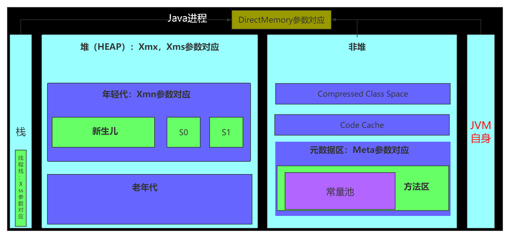

# 作业
***
## 作业一
### 作业要求：
&ensp;&ensp;&ensp;&ensp;自己写一个简单的Hello.java，里面需要涉及基本类型，四则运行，if和for，然后自己分析一下对应的字节码，有问题群里讨论。

&ensp;&ensp;&ensp;&ensp;学习中搜索到的相应参考链接：

- [字节码指令集oracle文档:https://docs.oracle.com/javase/specs/jvms/se7/html/jvms-6.html#jvms-6.5](https://docs.oracle.com/javase/specs/jvms/se7/html/jvms-6.html#jvms-6.5)

### 思路
- 1.首先在当前周下week_01下建立代码工程目录：code，并新建工程
- 2.编写代码文件：MyHello.java(src目录下)
- 3.编译生成：MyHello.class(build目录下)
- 4.字节码解释

#### MyHello.java

```java
import java.util.ArrayList;
import java.util.List;

public class MyHello {
    public static void main(String[] args) {
        int num1 = 1;
        int num2 = 130;
        int num3 = num1 + num2;
        int num4 = num2 - num1;
        int num5 = num1 * num2;
        int num6 = num2 / num1;

        final int num7 = 5;
        Integer num88 = 6;

        // 仅作为试验，看装箱指令
        if (num88 == 0) {
            System.out.println(num1);
        }

        List<Integer> nums = new ArrayList<>();
        nums.add(1);
        nums.add(2);

        for (int num : nums) {
            System.out.println(num);
        }

        if (nums.size() == num2) {
            System.out.println(num2);
        }
    }
}
```

### 字节码展示及相关说明

```shell script
PS C:\Users\12439\Documents\Code\Java\JAVA-000\Week_01\code\build\classes\java\main> javap -c .\MyHello.class
Compiled from "MyHello.java"
public class MyHello {
  public MyHello();
    // 调用父类Object的初始化函数
    Code:
       0: aload_0
       1: invokespecial #1                  // Method java/lang/Object."<init>":()V
       4: return

  public static void main(java.lang.String[]);
    Code:
       // 初始化变量num1
       0: iconst_1
       1: istore_1

       // 初始化化变量num2，这里的指令有些变化，这里查资料得到不同数据类型和访问值会用到不同的指令，可以看下面的int数据类型指令表
       2: sipush        130
       5: istore_2

       // 计算num3
       6: iload_1
       7: iload_2
       8: iadd
       9: istore_3
       
      // 计算num4
      10: iload_2
      11: iload_1
      12: isub
      13: istore        4

      // 计算num5
      15: iload_1
      16: iload_2
      17: imul
      18: istore        5

      // 计算num6
      20: iload_2
      21: iload_1
      22: idiv
      23: istore        6

      // 初始化化变量num7
      25: iconst_5
      26: istore        7

      // 初始化化变量num88,这里可以看到触发了Integer的自动装箱；想到写程序时还是尽量用基础类型，这样快点，不然会触发自动装箱/拆箱，多一些指令
      28: bipush        6
      30: invokestatic  #2                  // Method java/lang/Integer.valueOf:(I)Ljava/lang/Integer;
      33: astore        8

      // 判断，调用静态方法打印
      35: aload         8
      37: invokevirtual #3                  // Method java/lang/Integer.intValue:()I
      40: ifne          50
      43: getstatic     #4                  // Field java/lang/System.out:Ljava/io/PrintStream;
      46: iload_1
      47: invokevirtual #5                  // Method java/io/PrintStream.println:(I)V

      // 这里初始化list容器对象
      50: new           #6                  // class java/util/ArrayList
      53: dup
      54: invokespecial #7                  // Method java/util/ArrayList."<init>":()V
      57: astore        9

      // 这里获取list，生成Integer，进行添加
      59: aload         9
      61: iconst_1
      62: invokestatic  #2                  // Method java/lang/Integer.valueOf:(I)Ljava/lang/Integer;
      65: invokeinterface #8,  2            // InterfaceMethod java/util/List.add:(Ljava/lang/Object;)Z
      70: pop

      71: aload         9
      73: iconst_2
      74: invokestatic  #2                  // Method java/lang/Integer.valueOf:(I)Ljava/lang/Integer;
      77: invokeinterface #8,  2            // InterfaceMethod java/util/List.add:(Ljava/lang/Object;)Z
      82: pop

      // 获取迭代器
      83: aload         9
      85: invokeinterface #9,  1            // InterfaceMethod java/util/List.iterator:()Ljava/util/Iterator;
      90: astore        10
      // 遍历容器打印
      92: aload         10
      94: invokeinterface #10,  1           // InterfaceMethod java/util/Iterator.hasNext:()Z
      99: ifeq          128
     102: aload         10
     104: invokeinterface #11,  1           // InterfaceMethod java/util/Iterator.next:()Ljava/lang/Object;
     109: checkcast     #12                 // class java/lang/Integer
     112: invokevirtual #3                  // Method java/lang/Integer.intValue:()I
     115: istore        11
     117: getstatic     #4                  // Field java/lang/System.out:Ljava/io/PrintStream;
     120: iload         11
     122: invokevirtual #5                  // Method java/io/PrintStream.println:(I)V
     125: goto          92

     // 容器大小判断
     128: aload         9
     130: invokeinterface #13,  1           // InterfaceMethod java/util/List.size:()I
     135: iload_2
     136: if_icmpne     146
     139: getstatic     #4                  // Field java/lang/System.out:Ljava/io/PrintStream;
     142: iload_2
     143: invokevirtual #5                  // Method java/io/PrintStream.println:(I)V

     146: return
}
```

### int数据类型指令表
&ensp;&ensp;&ensp;&ensp;int(bool,byte,char,short)常用指令及范围如下：

- iconst: [-1, 5]
- bipush: [-128, 127]
- sipush: [-32768, 32767]
- idc: any int value

&ensp;&ensp;&ensp;&ensp;其他的就不展示了，搜索相关资料也能查到。字节码这部分内容感觉有个大概了解就行了，不必太深入。

## 作业二
### 作业要求：
&ensp;&ensp;&ensp;&ensp;自定义一个Classloader，加载一个Hello.xlass文件，执行hello方法，此文件内容是一个Hello.class文件所有字节(x=255-x)处理后的文件。文件群里提供。

### 思路
- 1.首先了解类加载的相关机制，为啥需要类加载器，这里大致写了一个自己的整理：[Java类加载器及自定义类加载器]()
- 2.自定义类加载器编写要点：
    - 1.继承类：ClassLoader，并重写方法：findClass
    - 2.核心加载函数：defineClass，其需要字节码文件的字节流及类名；则思路为读取字节码文件成字节流，传入字节流及函数名称即可
    - 3.字节流读取的特殊处理：应被相应加密处理过了，读取的时候进行相应的解密
    - 4.加载class文件，实例化，调用函数
    
 &ensp;&ensp;&ensp;&ensp;这里使用文件绝对路径
 
 ### 完整代码
 
 ```java
import java.io.*;
import java.lang.reflect.InvocationTargetException;

/**
 * 自定义类加载
 * 关键点是defineClass,读取字节码的字节流，生成class，思路就是转化class文件为字节流，传入defineClass中
 * 思路：
 * 1.继承ClassLoader，重写findClass方法
 * 2.从文件中读取转化成字节流
 * 3.传入defineClass进行加载
 * 4.生成实例，调用方法
 */
public class HelloClassLoader extends ClassLoader {
    @Override
    public Class findClass(String name) {
        byte[] b = new byte[0];
        try {
            b = loadClassFromFile(name);
        } catch (FileNotFoundException e) {
            e.printStackTrace();
        }
        // name 就是加载的类名称，这里注意要填写正确
        return defineClass("Hello", b, 0, b.length);
    }

    /**
     * 读取class文件，转化内容为字节流
     * @param fileName 文件路径
     * @return
     * @throws FileNotFoundException
     */
    private byte[] loadClassFromFile(String fileName) throws FileNotFoundException {
        System.out.println(fileName);
        File file = new File(fileName);
        FileInputStream inputStream = new FileInputStream(file);
        byte[] buffer;
        ByteArrayOutputStream byteStream = new ByteArrayOutputStream();
        int nextValue = 0;
        try {
            while ( (nextValue = inputStream.read()) != -1 ) {
                // 注意字节还原
                byteStream.write(255 - nextValue);
            }
        } catch (IOException e) {
            e.printStackTrace();
        }
        buffer = byteStream.toByteArray();
        return buffer;
    }

    public static void main(String[] args) throws ClassNotFoundException, NoSuchMethodException, IllegalAccessException, InstantiationException, InvocationTargetException {
        // 文件读取，字节流转换，加载
        String path = "C:\\Users\\12439\\Documents\\Code\\Java\\JAVA-000\\Week_01\\code\\src\\main\\resources\\Hello.xlass".replace("\\", "/");
        HelloClassLoader loader = new HelloClassLoader();
        Class hello = loader.loadClass(path);
        System.out.println(hello.getName());
        // 生成实例，调用方法
        Object instance = hello.newInstance();
        System.out.println(hello.getMethod("hello").invoke(instance));
    }
}
```

## 作业三
### 作业要求
&ensp;&ensp;&ensp;&ensp;画一张图，展示Xmx 、 Xms 、 Xmn 、 Meta 、 DirectMemory 、 Xss 这些内存参数的关系。

### 思路
&ensp;&ensp;&ensp;&ensp;首先要了解上面各个参数的含义：

- Xmx：指定最大堆内存
- Xms：指定堆内存空间的初始大小
- Xmn：设置新生代初始和最大大小；设置过小会导致频繁GC，过大会导致GC一次时间过长；建议1/2~1/4
- Meta(-XX:MaxMetaspaceSize=size)：设置Meta空间大小
- DirectMemory(-XX:MaxDirectMemorySize=size)：设置系统可使用的最大堆外内存
- Xss：设置每个线程栈的字节数

### 内存模型及相应参数对应图



## 作业四
### 作业要求 
&ensp;&ensp;&ensp;&ensp;检查一下自己维护的业务系统的JVM参数配置，用jstat和jstack、jmap查看一下详情，并且自己独立分析一下大概情况，思考有没有不合理的地方，如何改进。