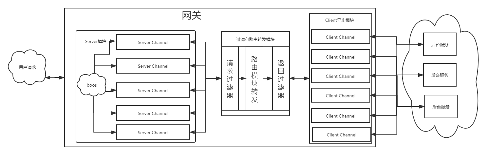

# 学习笔记

***
# 作业
***
&ensp;&ensp;&ensp;&ensp;当前的网关大体模块如下图：




&ensp;&ensp;&ensp;&ensp;代码地址 netty-gatewayDemo : [https://github.com/lw1243925457/netty-gatewayDemo](https://github.com/lw1243925457/netty-gatewayDemo)

## 功能简介
&ensp;&ensp;&ensp;&ensp;目前系统分为四个模块：server模块、route模块、client模块

- server模块：接收用户的请求，经过route模块解析后得到目标服务地址，client模块发送请求得到结果后，server返回给用户
- route模块：读取配置文件，加载路由配置，将不同的请求发送到不同的服务器
- client模块：同步非阻塞请求客户端，返回请求结果给server模块；目前使用第三方提供的，自己实现的性能不行
- Filter模块：对请求和返回进行处理，内置将请求方法都设置为POST，返回头中添加GATEWAY信息

&ensp;&ensp;&ensp;&ensp;类似于NGINX，将用户请求根据配置转发到相应的后端服务程序中。目前还不支持restful json的请求。

&ensp;&ensp;&ensp;&ensp;配置示例：

```json5
{
  "server": {
    "group1": [
      "http://192.168.101.105:8080"
    ],
    "group2": [
      "http://192.168.101.105:8080",
      "http://192.168.101.109:8080"
    ]
  },
  "route": [
    {
      "source": "/greeting",
      "target": "group1"
    },
    {
      "source": "/hello",
      "target": "group2"
    }
  ]
}
```

&ensp;&ensp;&ensp;&ensp;目前采用前缀匹配，示例如下：

- localhost:80/greeting/getSome
    - 前缀匹配到 /greeting，得到转发目标机器机器为group1，则将发送请求到："http://192.168.101.105:8080",多个服务器的会就会轮询发送
    - 转发后端URL为："http://192.168.101.105:8080/getSome"
    
## 相关测试
&ensp;&ensp;&ensp;&ensp;这里压测一下网关，基本命令如下，在2分钟左右基本能得到稳定值，不再大幅度抖动

```shell script
sb -u http://localhost:80/greeting -c 20 -N 120
```

&ensp;&ensp;&ensp;&ensp;得到的相关结果如下：

|测试条件说明                       |测试结果                          |
|----------                       |---------------------------------|
|不用网关直接访问单服务               | RPS: 5887.5 (requests/second)   |
|经过网关访问单服务                   | RPS: 5191.9 (requests/second)  |
|经过网关访问两个服务器（负载均衡）     | RPS: 5664.5 (requests/second)   |

&ensp;&ensp;&ensp;&ensp;经过上面的测试数据可以发现，经过网关性能是要差一些的。感觉这样应该是正常的，毕竟网络链路都要多走一步。

&ensp;&ensp;&ensp;&ensp;如果后端服务的host和port相同的话，那就相当于代理了，经过测试，如果简单代理的话，性能几乎是相同的。

&ensp;&ensp;&ensp;&ensp;目前网关假设是后端服务会有不同的ip地址和端口，所以Server端测试的时候线程新建和销毁比代理要多，而且客户端必须是异步的，有状态的客户端会导致更多的线程新建和销毁。

&ensp;&ensp;&ensp;&ensp
;经过网关访问两个服务器（负载均衡）的测试结果不是预料中的，想象中应该是两倍的性能，但这里要考虑到网关的性能是否能够支撑了。由于机器的性能基本上已经打满了，这里就没法去测试这个准确的。但可以看到相对于单服务器，两个服务器的性能是有所提升的。

&ensp;&ensp;&ensp;&ensp;目前来看功能上是达到作业要求了，但性能上可能有些不足。做下来感觉网关这个东西还有很多很多的点，这里只是一小部分，不简单。


***
# Netty学习总结
***
*没时间搞太详细的总结了，就简单的写写了，想写出一个Netty的同步非阻塞高性能客户端有点难，时间大部分花在这上面了，但还是没写出来*

## 相关知识点
### 线程模型
- 线程模型：BIO、伪异步I/O、NIO、AIO
- reactor线程模型：Reactor单线程、Reactor多线程、主从Reactor多线程模型、Netty自定义线程模型

### 服务端一般流程
启动-创建连接-接收请求-处理业务-发送相应-断开连接-关闭服务

处理业务包含了编解码、过滤、拦截等操作

### 客户端一般流程
启动-连接服务端-发送请求-接收响应-处理业务-关闭服务

### 一些参数优化
- Linux参数：/proc/sys/net/ipv4/tcp_keepalive_time,最大文件打开句柄数
  - ulimit -n xxxx
- SO_BACKLOG, 1024
- TCP_NODELAY true
- AUTO_CLOSE
- SO_REUSEADDR

### 易于调试的一些设置
- 完善线程名
- 完善handler名称
- 日志设置
- 数据可视化：当前连接数、线程数


## 一些需要注意的点
- ctx.channel.write/ctx write 的区别
  - ctx.channel.write：会从tailContext开始，一般在客户端使用
  - ctx.write：从当前context，一般在服务端使用

- SimpleChannelInboundHandler/SimpleChannelOutboundHandler：一般最后的handler可以直接继承这个，会自动释放buf